# Freight billing reconciliation

An agent system that reconciles BlueFin Commerce's carrier freight invoices against its own shipment records and
the carriers' prose rate contracts. For a billing period it produces:

- **`reconciliation-report.json`**: one row per invoice line (contract amount, delta, disposition, justification,
  clause), invoice-level findings, invoice totals and a summary. It conforms to
  [`report.schema.json`](report.schema.json).
- **`memos/`**: one short memo for every line or finding that is not accepted, written for the carrier-relations
  colleague who has to act on it.

The system is a [Flowstate](#flowstate-graph-runtime) graph. Deterministic code does all parsing, matching,
pricing, policy and verification. Claude agents do only what needs reading or judgement: transcribing contracts,
choosing between two policy-offered dispositions, and writing memo prose. A Claude orchestrator supervises the run
through the Flowstate CLI and cannot change anything itself.

The files at the repository root come from a real run, `freight-2026-07`, whose complete evidence is committed under
[`runs/`](runs/). The exercise brief is in [`PROBLEM.md`](PROBLEM.md); design rationale in [`DESIGN.md`](DESIGN.md);
the phase-by-phase build record in [`IMPLEMENTATION_LOG.md`](IMPLEMENTATION_LOG.md).

---

## Contents

1. [Quick start](#1-quick-start)
2. [The July 2026 result](#2-the-july-2026-result)
3. [How it works](#3-how-it-works)
4. [What is guaranteed, and where it is checked](#4-what-is-guaranteed-and-where-it-is-checked)
5. [Repository layout](#5-repository-layout)
6. [Components](#6-components)
7. [Configuration](#7-configuration)
8. [Run evidence](#8-run-evidence)
9. [Testing](#9-testing)
10. [Extending the system](#10-extending-the-system)
11. [Troubleshooting](#11-troubleshooting)
12. [Judgement calls and limitations](#12-judgement-calls-and-limitations)
13. [Further reading](#13-further-reading)

---

## 1. Quick start

### Prerequisites

| Tool | Why | Notes |
|---|---|---|
| `python3` (3.12 used) | Flowstate, agentctl and the `freight` package | Dependencies: `pyyaml`, `jsonschema`, `pydot` |
| `tmux` | Every worker and detached process runs in a tmux session | Required, including for the token-free tests |
| `jq` | Launcher scripts and demo flows | |
| `git` | Checked by setup | |
| [Claude Code](https://claude.com/claude-code) CLI (`claude`), logged in | The orchestrator and the agent workers | Only for real runs; tests use a scripted fake worker |

Graphviz is **not** required: DOT files are parsed with `pydot`.

### Setup

```bash
orchestrator/setup.sh                                                  # creates orchestrator/.venv
orchestrator/.venv/bin/pip install -r orchestrator/requirements-dev.txt   # adds pytest, for the test suites
```

### Reconcile a billing period

In an interactive Claude Code session at the repository root:

```
/reconcile-freight 2026-07
```

Or headless, from a shell:

```bash
factory/flows/freight-reconciliation/reconcile.sh 2026-07
```

Both start the same thing:
1. A Claude orchestrator loads the `reconcile-freight` skill, which loads `graph-orchestrator`.
2. It validates and initialises a run of the `freight-reconciliation` flow.
3. It supervises the run until it completes or needs a human.

On completion, `reconciliation-report.json` and `memos/` are published at the repository root, replacing the
previous ones.

Headless options (environment variables of `reconcile.sh`):

| Variable | Default | Meaning |
|---|---|---|
| `MODEL` | `sonnet` | Orchestrator model (workers' models are fixed per node in the flow) |
| `BUDGET` | `5` | Orchestrator session budget in USD (workers have their own per-node budgets) |
| `RUNS_DIR` | `runs` | Where the run directory is created |
| `RUN_ID` | `freight-<period>-<UTC timestamp>` | Run id |
| `PUBLISH_DIR` | repository root | Where the report and memos are published |
| `FRESH_EXTRACTION` | unset | Set to re-read every contract instead of using the rate-spec cache |

A trial run that leaves the committed deliverables untouched:

```bash
RUNS_DIR=runs/_trial PUBLISH_DIR=runs/_trial/published factory/flows/freight-reconciliation/reconcile.sh 2026-07
```

**Time and cost.** The July 2026 run took about 2.5 minutes. It cost about $1.75 in workers (six Opus contract
extractions, one Sonnet adjudication batch and one Sonnet memo batch) and about $0.26 in orchestrator time. With
the rate-spec cache warm, the six extractions are skipped.

### Driving the flow without an orchestrator agent

The Flowstate CLI can run the flow directly; the orchestrator only automates the decisions:

```bash
orchestrator/bin/flowstate validate freight-reconciliation
orchestrator/bin/flowstate init freight-reconciliation --var period=2026-07 --run-id my-run
orchestrator/bin/flowstate advance my-run --max-wait 300     # repeat until "completed", or act on the situation
orchestrator/bin/flowstate status my-run
```

---

## 2. The July 2026 result

Run `freight-2026-07` reconciled the five July invoices plus the credit note that corrects one of them.

| Scope | Documents | Lines |
|---|---|---|
| Alpine Express (JSON) | `ALPINE-0726` | 40 |
| Falcon Freight (text) | `FALCON-2026-07A`, `FALCON-2026-07B`, credit note `FALCON-CN-01` | 18 + 18 + 1 |
| Sagar Roadlines (CSV) | `SAGAR-JUL-1`, `SAGAR-JUL-2` | 25 + 25 |

The invoice folder holds 17 documents; the other 11 (August and September, and `SAGAR-CN-01`, which corrects an
August invoice) are out of scope and read only to detect duplicate billing.

**Summary:**
- 127 lines: 122 accepted, 4 disputed, 1 escalated; plus 1 escalated invoice finding.
- ₹8,832.00 in dispute.
- `total_expected` is null because one line's contract amount is undetermined, as the schema requires.

| Item | Disposition | Why |
|---|---|---|
| `FALCON-2026-07A` / FF-8011 | dispute ₹1,200.00 | A detention charge the contract does not provide for (§5 allows no other accessorials) |
| `FALCON-2026-07B` / FF-8003 | dispute ₹7,392.00 | The consignment was already billed on `FALCON-2026-07A` |
| `SAGAR-JUL-1` / SG-7003 | dispute ₹40.00 | The invoice's own charges do not add up; decided by bounded adjudication |
| `SAGAR-JUL-1` / SG-7009 | dispute ₹200.00 | Billed above the contract's weight + distance freight |
| `ALPINE-0726` / AE-3005 | escalate | A consignment of exactly 50 kg: the contract rates "under 50 kg" and "over 50 kg" only |
| `ALPINE-0726` (finding) | escalate | The 5% volume discount applies (40 consignments), but with one line undetermined the invoice's contract total, and so the discount, cannot be computed |
| `FALCON-2026-07A` / FF-8005 and `FALCON-CN-01` | accept | The overbilling of ₹496.80 is exactly corrected by the credit note; the difference is counted once, on the credit line (residual 0.00) |

The six memos are in [`memos/`](memos/). The report was verified at assembly and again before publishing, and it
validates against `report.schema.json`. An earlier dry run extracted every contract independently: its specs
price identically, and every amount, finding, total, disposition and memo file matches this run's.

---

## 3. How it works

### Division of labour

| Part | Does | Never does |
|---|---|---|
| **Code** (`freight` package, script nodes) | Parses invoices, decides scope, prices every line from shipment records and rate specs, applies the disposition policy, assembles, verifies, publishes | Reads prose contracts or writes prose |
| **Agent workers** (launched by Flowstate) | Transcribe a contract into a rate spec (Opus); choose between two offered dispositions (Sonnet); draft memo prose (Sonnet) | Compute or change an amount; choose outside the offered options; read anything beyond their assignment |
| **Gates and re-checks** | Prove every output is well formed, traced to its sources, complete and grounded | Repair outputs |
| **Flowstate + agentctl** | Order, state, schema validation, gates, isolated workers, retries, recovery | Decide what a failure means |
| **Orchestrator** (Claude with two skills) | Reads situations and evidence; retries, respawns or pauses through Flowstate | Edits files, starts workers, or influences amounts, dispositions, clause readings or memo text |

### The graph

`factory/flows/freight-reconciliation/freight-reconciliation.dot` has 25 nodes: 11 script nodes, 4 agent nodes,
4 dynamic fan-outs and 4 joins, plus start and done.

```mermaid
flowchart TD
  start([start]) --> discover[discover<br/><i>script</i>]
  discover -- "gate: scope-resolved" --> rules_plan[rules_plan<br/><i>script</i>]
  rules_plan --> extract_fan{{extract_fan}}
  extract_fan --> extract_rules[extract_rules<br/><b>agent: Opus</b><br/>2 copies per carrier]
  extract_rules -- "gates: rate-spec-traced,<br/>worker-inputs-only" --> extract_join{{extract_join}}
  extract_join --> rules_agree[rules_agree<br/><i>script</i>]
  rules_agree --> rerun_fan{{rerun_fan<br/>usually empty}}
  rerun_fan --> extract_rules_rerun[extract_rules_rerun<br/><b>agent: Opus</b>]
  extract_rules_rerun -- "gates: rate-spec-traced,<br/>worker-inputs-only" --> rerun_join{{rerun_join}}
  rerun_join --> rules_final[rules_final<br/><i>script</i>]
  rules_final --> price[price<br/><i>script</i>]
  price -- "gate: priced-covers-scope" --> adjudication_plan[adjudication_plan<br/><i>script</i>]
  adjudication_plan --> adjudicate_fan{{adjudicate_fan}}
  adjudicate_fan --> adjudicate[adjudicate<br/><b>agent: Sonnet</b><br/>per batch]
  adjudicate -- "gates: adjudications-grounded,<br/>worker-inputs-only" --> adjudicate_join{{adjudicate_join}}
  adjudicate_join --> merge_adjudications[merge_adjudications<br/><i>script</i>]
  merge_adjudications --> assemble[assemble<br/><i>script</i>]
  assemble --> memo_plan[memo_plan<br/><i>script</i>]
  memo_plan --> memo_fan{{memo_fan}}
  memo_fan --> write_memos[write_memos<br/><b>agent: Sonnet</b><br/>per batch]
  write_memos -- "gates: memos-grounded,<br/>worker-inputs-only" --> memo_join{{memo_join}}
  memo_join --> render_memos[render_memos<br/><i>script</i>]
  render_memos --> publish[publish<br/><i>script</i>]
  publish --> done([done])
```



### Stage by stage

#### 1. Discovery and parsing (`discover`)

- **Parsing.** Every file in `data/invoices/` is parsed by exactly one strict parser, chosen by sniffing its
  format:

  | Format | Parser | Carrier |
  |---|---|---|
  | `alpine-json` | `freight/parsers/alpine_json.py` | Alpine Express |
  | `falcon-text` | `freight/parsers/falcon_text.py` | Falcon Freight |
  | `sagar-csv` | `freight/parsers/sagar_csv.py` | Sagar Roadlines |

- **Normalised documents.** Each document becomes lines with charges mapped to a shared vocabulary of charge codes
  (`freight`, `freight_incl_fuel`, `fuel_surcharge`, `express_premium`, `cold_chain_premium`,
  `residential_delivery`, `fragile_handling`, `handling`, `detention`, plus `credit` and `other`). It keeps:
  - the invoice's stated attributes, as evidence only;
  - its stated totals;
  - **integrity facts**: the invoice's own arithmetic, recorded, never corrected.
- **Failures.** Unknown text or formats stop discovery instead of being guessed at.
- **Scope rule.** Invoices whose billing period is the run's period are in scope, together with credit notes
  that correct an in-scope invoice. Everything else is `reference` (kept for cross-period duplicate detection)
  or `unresolved`.
- **Gate `scope-resolved`.** Nothing may be unresolved and something must be in scope; otherwise the run stops
  for a human.

Parsing is a single script node rather than a fan-out per file: it is cheap sequential code, and every
parallel branch has a Flowstate state cost.

#### 2. Contract extraction (`rules_plan` → `extract_rules` → `rules_agree` → `rules_final`)

Contracts are prose, so agents transcribe each one into a **rate spec**
([`definitions/rate-spec.json`](factory/flows/freight-reconciliation/definitions/rate-spec.json)): a closed set of
building blocks that code evaluates.

- **Quantities**: `max` / `min` of shipment fields and constants (e.g. "chargeable weight is the higher of actual
  weight and 25 kg").
- **Components**: `flat`, `per_unit`, `banded_rate` (band ends inclusive or exclusive exactly as worded),
  `percent_of` earlier components. Each component carries an optional condition (`service_level`,
  `special_handling_includes`, `unrecorded`, `all` / `any` / `not`) and the invoice charge codes it accounts for.
- **Scope and adjustments**: allowed service levels, term, and invoice discounts gated on consignments in the
  billing month.
- **Accounting for every clause**: `gaps` (what the contract leaves undetermined), `non_pricing` (clauses that
  don't affect a price) and `unrepresentable` (terms the format cannot express; any entry stops the run).

The steps:
1. **`rules_plan`** builds a clause index of each in-scope carrier's contract, collects the vocabulary of
   shipment values and the charge codes the carrier's invoices can carry, and looks up the cache. For every
   carrier without a valid cached spec, it assigns **two independent extraction copies**.
2. **`extract_rules`** (Opus, one branch per copy) reads only the contract and its clause index, following
   [`prompts/extract-rules.md`](factory/flows/freight-reconciliation/prompts/extract-rules.md) and its
   [rate-spec guide](factory/flows/freight-reconciliation/prompts/reference/rate-spec-guide.md). Each copy must
   pass two gates:
   - `rate-spec-traced`: schema and semantic checks; carrier, contract file, agreement and term match the header;
     **every number the spec prices appears in a clause it cites**; every clause is accounted for; conditions use
     values that exist in shipment records.
   - `worker-inputs-only`: the worker's own transcript shows it read only its assigned inputs and wrote only in
     its branch. This is what makes the two copies verifiably independent.
3. **`rules_agree`** compares the two copies **by behaviour, not wording**. Both specs price the same probe
   shipments: every field value at and between every threshold, crossed with every service level and handling
   combination. They must agree on:
   - the amount;
   - gap and out-of-card flags;
   - the status of every charge code the carrier bills;
   - whether the service is offered;
   - the term and the invoice discounts.

   If they agree, copy A is adopted. If they disagree, **one fresh round** (copies C and D) runs and must agree on
   its own.
4. **`rules_final`** adopts the specs and writes the cache. If any carrier still has no agreed spec, it exits 1
   and the run stops for a human with the evidence in `artefacts/rules/`.

**Cache.** An entry is keyed by `sha256(contract hash | rate-spec format version | prompt version)`. It is
re-traced against the contract on every use, and reused only if extracted against the same shipment vocabulary
and invoice charge codes.

#### 3. Pricing and policy (`price`)

**Pricing** (`freight/pricing.py`) uses shipment records and the adopted spec only; invoice attributes are
compared as evidence and never used to price. Exact decimal arithmetic, rounded half-up once per line. Each line
gets a component breakdown, the clauses behind its amount, and flags:

| Flag | Meaning | Policy effect |
|---|---|---|
| `NO_SHIPMENT_MATCH`, `SHIPMENT_AMBIGUOUS`, `SHIPMENT_DATA_MISSING`, `CARRIER_MISMATCH` | The line cannot be tied to one usable shipment record | escalate |
| `OUTSIDE_TERM` | Ship date outside the agreement | escalate |
| `CONTRACT_GAP`, `OUTSIDE_RATE_CARD` | No rate band covers the value | escalate |
| `UNRECOGNIZED_CHARGE` | The parser could not classify a charge label | escalate |
| `CHARGE_UNVERIFIABLE`, `CONDITION_UNVERIFIABLE` | Only a fact the records do not hold could settle it | escalate |
| `CREDIT_NOTE_UNMATCHED`, `CREDIT_NOTE_UNDETERMINED` | A credit note cannot be tied to a priced original | escalate |
| `CREDIT_NOTE_OFFSET` | The line's difference is carried by its credit-note line | accept (counted once) |
| `DUPLICATE_BILLING` | Already billed earlier; expected amount 0 | dispute |
| `UNCONTRACTED_CHARGE` | A recognised charge the contract does not provide for | dispute |
| `SERVICE_NOT_OFFERED`, `NOT_DELIVERED`, `COMPONENT_ARITHMETIC` | Needs judgement | adjudication between `[policy outcome, escalate]` |
| `CHARGE_NOT_APPLICABLE`, `ATTRIBUTE_MISMATCH`, `UNDERBILLED`, `CREDIT_NOTE` | Context | recorded in justification and memos |

**Disposition without flags:** a line is disputed if billed exceeds expected by more than ₹0.01; otherwise
(including underbilling) it is accepted.

**Invoice-level findings:**
- `ADJUSTMENT_MISMATCH`: a discount wrongly applied (disputed if BlueFin was overcharged).
- `ADJUSTMENT_UNDETERMINED`: escalated.
- `INVOICE_TOTAL_MISMATCH`: the stated total differs from the invoice's lines (disputed if it overcharges).

**Credit notes:** a credit line's expected amount is the correction the contract entitles BlueFin to (original
expected − original billed − earlier credits).

**Policy** lives in [`config/policy.yml`](factory/flows/freight-reconciliation/config/policy.yml). Every flag must
have an entry; unknown flags fail closed.

**Gate `priced-covers-scope`:** every in-scope line priced exactly once, and every line and finding decided or
offered for judgement.

#### 4. Adjudication (`adjudication_plan` → `adjudicate` → `merge_adjudications`)

- **Packets.** Lines left open by policy are batched (10 per batch by default). Each packet holds the computed
  facts, the two offered options and the full clause text of the contract.
- **Decisions.** The adjudicator ([`prompts/adjudicate.md`](factory/flows/freight-reconciliation/prompts/adjudicate.md),
  Sonnet) returns one decision per line: a disposition, cited clause ids and a justification of at most 600
  characters. Decisions have **no amount fields**.
- **Gate `adjudications-grounded`.** Every line decided once, only offered dispositions, clause ids that exist,
  and **every figure in the justification present in the packet**. The `worker-inputs-only` audit applies too.
- **Merge.** `merge_adjudications` re-checks every batch and requires every open line decided exactly once. If
  nothing is open, the fan-out is empty.

#### 5. Assembly (`assemble`)

Builds the report:
- amounts from pricing;
- dispositions from policy or adjudication;
- deterministic justifications citing clauses;
- invoice totals and the summary.

It then verifies:
- `report.schema.json`;
- one row per in-scope line;
- `delta = billed − expected`, with both null together;
- recomputed totals;
- no disputed line that a credit note offsets, so every disputed rupee is counted exactly once;
- dispositions allowed by policy.

#### 6. Memos (`memo_plan` → `write_memos` → `render_memos`)

- **Planning.** `memo_plan` creates one facts entry per non-accept line and finding of the verified report, in
  batches of 8.
- **Drafting.** The writer ([`prompts/write-memos.md`](factory/flows/freight-reconciliation/prompts/write-memos.md) +
  [style guide](factory/flows/freight-reconciliation/prompts/reference/memo-style.md), Sonnet) drafts four prose
  fields: headline, what we found, contract basis, next step.
- **Gate `memos-grounded`.** Every memo drafted once, within length limits, and every figure copied from that
  memo's facts.
- **Rendering.** `render_memos` writes `memos/<id>.md`. The **facts table is rendered by code from the report**
  (disposition, carrier, invoice and line, consignment, shipment, billed, contract amount, difference, clauses);
  the agent supplies only prose.
- **Memo ids** are derived from what an item is, e.g. `ALPINE-0726-line-005` and
  `ALPINE-0726-finding-adjustment-undetermined-discount-5pct-from-13`, so they are stable across runs.

#### 7. Publication (`publish`)

Re-verifies the report (schema, invariants, line count from the manifest) and that the run's memos are exactly one
per non-accept item. It then copies `reconciliation-report.json` and `memos/` to `publish_dir`. An existing
`memos/` is replaced only if it contains nothing but `.md` files. The report's SHA-256 is recorded in
`artefacts/publication.json`.

---

## 4. What is guaranteed, and where it is checked

| Guarantee | Enforced by |
|---|---|
| Workers see only what the graph gives them: file tools only; no shell, web, project `CLAUDE.md`, skills, auto-memory or MCP servers | agentctl's Claude harness flags, verified by `orchestrator/tests/live/probe_isolation.py` |
| Every output has the declared shape and came from the worker Flowstate launched | JSON Schema plus a `_session_id` check on every node output |
| No document is silently dropped or guessed into scope | Strict parsers; gate `scope-resolved` |
| A contract reading is traceable, complete and independently confirmed | Gates `rate-spec-traced` and `worker-inputs-only` on each copy; behavioural agreement of two copies; bounded second round; stop for a human otherwise |
| A reading is never reused against changed inputs | Cache key (contract, format, prompt) plus re-tracing and an input check on every hit |
| Every in-scope line is priced exactly once and decided | Gate `priced-covers-scope` |
| Agents never produce or change an amount | Decision and memo formats have no amount fields; grounding checks every quoted figure against the facts given |
| The report meets the fixed contract and counts each disputed rupee once | `assemble` verification, Flowstate schema validation, `publish` re-verification |
| Code, policy or config cannot change under a running reconciliation | The flow digest, extended by `digest_include` to `freight/**/*.py`, `config/*.yml`, `scripts/_paths.sh` |
| The orchestrator cannot bypass any of this | The skills' rules, plus launcher permissions: Bash only for `orchestrator/bin/flowstate`, no Write or Edit |

The reasoning behind each placement is in [`DESIGN.md` §2](DESIGN.md#2-what-is-validated-where-and-why-there).

---

## 5. Repository layout

```
.
├── README.md, DESIGN.md, IMPLEMENTATION_LOG.md, CLAUDE.md   documentation
├── PROBLEM.md, brief.md                                     the exercise brief and background
├── report.schema.json                                       the fixed output contract
├── reconciliation-report.json, memos/                       deliverables (published by run freight-2026-07)
├── data/
│   ├── shipments.json                                       BlueFin's shipment records (ground truth)
│   ├── contracts/*.md                                       three prose rate contracts
│   └── invoices/                                            17 invoice documents, three formats
├── .claude/skills/
│   ├── graph-orchestrator/  SKILL.md, situations.md         generic Flowstate supervision procedure
│   └── reconcile-freight/   SKILL.md                        entry point: /reconcile-freight YYYY-MM
├── orchestrator/
│   ├── setup.sh, requirements.txt, requirements-dev.txt
│   ├── bin/flowstate, bin/agentctl                          CLI wrappers
│   ├── lib/agentctl/                                        worker lifecycle (tmux, registry, harnesses)
│   ├── lib/flowstate/                                       graph runtime
│   └── tests/                                               runtime tests, fixtures, live scripts
├── factory/
│   ├── factory-prefs-example.yml                            copied to factory-prefs.yml (gitignored) on first use
│   └── flows/
│       ├── freight-reconciliation/                          the reconciliation flow (below)
│       ├── smoke-test/, smoke-branch/, smoke-fanout/        demo flows
└── runs/
    ├── freight-2026-07/                                     committed evidence of the submitted run
    ├── freight-2026-07.orchestrator/                        the orchestrator session of that run
    └── _*/                                                  scratch runs and the rate-spec cache (gitignored)
```

The flow directory:

```
factory/flows/freight-reconciliation/
├── freight-reconciliation.dot, freight-reconciliation.flow.yml   graph, output schemas, variables, digest_include
├── reconcile.sh                                                  headless launcher
├── config/carriers.yml                                           carrier → name, contract, consignment prefix, invoice formats
├── config/policy.yml                                             flag → disposition effects, tolerance
├── definitions/*.json                                            JSON Schemas for every node output (incl. rate-spec.json)
├── prompts/extract-rules.md, adjudicate.md, write-memos.md       agent prompts
├── prompts/reference/rate-spec-guide.md, memo-style.md           reference material included into prompts
├── gates/*.sh                                                    6 gates (thin wrappers around python -m freight)
├── scripts/*.sh                                                  11 script nodes + _paths.sh
├── freight/                                                      the Python package (see §6)
└── tests/                                                        207 tests, isolation flows, live scripts
```

---

## 6. Components

### agentctl: worker lifecycle

`orchestrator/bin/agentctl --registry DIR {spawn,wait,send,kill,status,list,logs}`. JSON on stdout.

- **Process model.** Each worker invocation runs `claude -p --output-format stream-json` inside a detached tmux
  session. `send` continues the same session (`--resume`). Stall detection watches transcript growth.
  - States: running, stalled, exited, failed, killed, lost.
- **Registry.** Lives inside the run (`runs/<run>/workers/<worker>/`): `meta.json`, `prompt.md`, the aggregate
  `transcript.jsonl` and `stderr.log`, and per-invocation `command.json`, transcript, pids, `result.json` and
  `exit_code`.
- **Isolation.** Worker flags were chosen by experiment:
  - `--tools` and `--allowedTools` limited to Read, Write, Edit, Glob and Grep;
  - `--disallowedTools Bash,WebFetch,WebSearch`;
  - `--setting-sources ""`, `--disable-slash-commands`, `--safe-mode`, `--strict-mcp-config`;
  - `--permission-prompts none`, and inherited `CLAUDE*` session variables removed.
- **Harnesses.** `claude` (real) and `fake` (a scripted worker for token-free tests).

### Flowstate: graph runtime

`orchestrator/bin/flowstate [--runs-dir DIR] {validate,init,advance,retry,respawn,pause,resume,abort,status,events}`.
JSON on stdout.

- **Flows.** A `<name>.dot` plus `<name>.flow.yml` (output schemas, typed variables, optional `digest_include`).
  Node kinds: start, done, agent (`prompt_template`), script (`runner=script`), `fork`, `dynamic_fanout`
  (`items=`), and `join` (optional reducer). Edges carry gates and safe conditions (no `eval`).
- **Static validation** runs before any run exists: attributes, referenced files, schemas, acyclicity, regions,
  and a dataflow check that every variable used is set on every path.
- **Advancing a node.** Outputs exist → schema valid → `_session_id` matches (agents) → variables bound → one
  edge chosen → its gates pass → one atomic commit to `state.yaml`.
- **Situations.** `advance` returns exactly one: `completed`, `paused`, `worker_running`, `validation_failed`,
  `gate_failed`, `worker_failed`, `worker_stalled`, `script_failed`, `flow_changed`, … (the full reference is in
  [`.claude/skills/graph-orchestrator/situations.md`](.claude/skills/graph-orchestrator/situations.md)).
- **Recovery actions.** `retry` sends structured feedback into the same worker session. `respawn` starts a new
  worker. Both share the node's retry budget. `pause`, `resume` and `abort` complete the set.
- **Durability.** `state.yaml` is authoritative and lock-protected; `events.jsonl` is append-only; scripts run
  detached. A new `advance` reconnects to running work instead of repeating it.
- **Parallel regions.** Branches run concurrently, each with an isolated artefact directory. A join completes
  when every branch has arrived. An empty fan-out skips straight through.

### Skills

- **[`graph-orchestrator`](.claude/skills/graph-orchestrator/SKILL.md)** is a domain-free supervision procedure:
  - advance, classify the situation, inspect the evidence, then retry, respawn or pause;
  - never edit run state, flows or outputs; never start or kill workers; never keep a private retry counter;
  - prefer pausing to aborting.
- **[`reconcile-freight`](.claude/skills/reconcile-freight/SKILL.md)** is the entry point:
  - validate the flow, then init with only the inputs the human gave;
  - supervise with graph-orchestrator, using a table of what this flow's situations mean (e.g. a failed tracing
    gate → retry that branch; a failed audit gate → respawn; an extraction that cannot be adopted → pause);
  - report from `publication.json`.

  It forbids the orchestrator from suggesting dispositions, amounts, clause readings or memo text.

### The `freight` package

`PYTHONPATH=factory/flows/freight-reconciliation orchestrator/.venv/bin/python -m freight --help` lists every
command. Script nodes and gates are thin wrappers around these.

| Module | Responsibility |
|---|---|
| `money.py`, `vocab.py` | Decimal INR arithmetic; charge-code and shipment-field vocabularies |
| `parsers/` | One strict parser per invoice format, each declaring the charge codes it emits |
| `documents.py` | Carrier config, discovery, scope manifest |
| `contracts.py` | Clause index: clauses, sections, agreement, term, the numbers in each clause |
| `ratespec.py` | Rate-spec validation beyond the schema (ordering, bands, names) |
| `tracing.py` | A spec's numbers and citations traced to its contract |
| `agreement.py` | Behavioural comparison of two specs on probe shipments |
| `rules.py` | Extraction assignments, agreement rounds, adoption, cache |
| `audit.py` | Worker transcript audit (what it read and wrote) |
| `pricing.py` | Matching, evaluation, flags, credit notes, invoice-level findings |
| `policy.py` | Flags → dispositions or bounded judgement |
| `coverage.py` | Scope and pricing coverage checks |
| `adjudication.py` | Adjudication packets, decision checks, merge |
| `grounding.py` | Figures in agent prose must come from the facts given |
| `report.py` | Report assembly and verification |
| `memos.py` | Memo facts, draft checks, rendering |
| `publish.py` | Final re-verification and publication |
| `cli.py` | Command-line entry points |

---

## 7. Configuration

### Flow input variables

Set with `flowstate init … --var NAME=VALUE`. Paths may be absolute or relative to the repository root.

| Variable | Default | Meaning |
|---|---|---|
| `period` | (required) | Billing period `YYYY-MM` |
| `invoices_dir` | `data/invoices` | Invoice documents |
| `shipments_file` | `data/shipments.json` | Shipment records |
| `carriers_config` | `factory/flows/freight-reconciliation/config/carriers.yml` | Carrier master data |
| `data_root` | `.` | Root for the contract paths in the carrier config |
| `report_schema` | `report.schema.json` | The output contract |
| `rules_cache_dir` | `runs/_cache/rate-specs` | Rate-spec cache |
| `use_rules_cache` | `true` | `false` re-extracts every contract; the cache is then neither read nor written |
| `adjudication_batch_size` | `10` | Open lines per adjudication worker |
| `memo_batch_size` | `8` | Memos per memo worker |
| `publish_dir` | `.` | Where the report and memos are published |

### Carriers (`config/carriers.yml`)

```yaml
carriers:
  falcon:
    name: Falcon Freight Pvt Ltd
    contract: data/contracts/falcon-freight.md
    consignment_prefix: "FF-"
    invoice_formats: [falcon-text]
```

### Policy (`config/policy.yml`)

`tolerance_inr`, one effect per line flag (`escalate`, `offset`, `dispute`, `judgement`, `info`), and a
disposition per direction for each invoice-level finding. The policy loader rejects a file that does not cover
exactly the flags pricing can raise.

### Runtime preferences (`factory/factory-prefs.yml`)

Created from `factory/factory-prefs-example.yml` on first use (gitignored). The keys:
- `supervision`: `high` makes `pause_at=optional` nodes pause.
- `max_retries`: default 2 per node.
- `stall_after_s`, `script_timeout_s`.
- `max_parallel_branches`, `max_fanout_items`.
- `default_graph`.

Agent nodes set their own model, budget and stall threshold in the DOT file:
- extraction: Opus, $5, stall after 900 s;
- adjudication and memos: Sonnet, $2.

---

## 8. Run evidence

Every run writes `runs/<run_id>/`:

| Path | Contents |
|---|---|
| `state.yaml` | Authoritative state: every node, attempt, worker, gate evaluation, branch and variable |
| `events.jsonl` | Ordered history (run created, nodes launched and completed, gates passed, retries, …) |
| `artefacts/discovery/` | Scope manifest and every parsed document |
| `artefacts/rules/` | Plan, clause indexes, shipment vocabulary, `agreement-1.json`, `final.json`, adopted `specs/` |
| `artefacts/branches/<branch>/` | Each worker's output: every extraction copy's rate spec, adjudication decisions, memo drafts |
| `artefacts/pricing/priced.json` | Every priced line with components, flags and policy decisions |
| `artefacts/adjudication/` | Packets, batches, merged decisions |
| `artefacts/report/reconciliation-report.json` | The verified report |
| `artefacts/memo-work/`, `artefacts/memos/` | Memo packets, render index, rendered memos |
| `artefacts/publication.json` | What was published, where, with the report's SHA-256 |
| `workers/<worker>/` | Each worker's prompt, full stream-json transcript, stderr and invocation records |
| `logs/` | stdout, stderr and results of every script and gate evaluation |

The headless launcher also writes `runs/<run_id>.orchestrator/`: prompt, transcript, tool calls, result (cost,
turns, permission denials), final report, run status, interventions and the launcher's console log.

**The submitted run.** `runs/freight-2026-07/` and `runs/freight-2026-07.orchestrator/` are committed exactly as
produced. Useful checks:

```bash
orchestrator/bin/flowstate status freight-2026-07 | jq '{status, completed_nodes}'
orchestrator/bin/flowstate events freight-2026-07 --type gate_passed | jq length          # 18
jq '.carriers | map_values(.status)' runs/freight-2026-07/artefacts/rules/agreement-1.json
shasum -a 256 reconciliation-report.json; jq .report_sha256 runs/freight-2026-07/artefacts/publication.json
cat runs/freight-2026-07.orchestrator/tool-calls.jsonl
```

Two runs can be compared (specs, amounts, dispositions, and whether policy or adjudication decided each difference):

```bash
orchestrator/.venv/bin/python factory/flows/freight-reconciliation/tests/live/compare_runs.py RUN_DIR_A RUN_DIR_B
```

---

## 9. Testing

Both suites spend no tokens: agent nodes run a scripted fake worker through the real runtime. tmux is required.

```bash
(cd orchestrator && .venv/bin/python -m pytest)                                                # 159 tests
(cd factory/flows/freight-reconciliation && ../../../orchestrator/.venv/bin/python -m pytest)  # 207 tests
```

**Orchestrator suite** (`orchestrator/tests/`):
- agentctl harnesses, lifecycle, transcripts and environment;
- Flowstate loader, validation and condition language; engine state machine and recovery; fork, join and
  fan-out; digest coverage;
- the graph-orchestrator skill checked against the real CLI and runtime, plus a scripted supervisor that follows
  it through failure drills.

**Freight suite** (`factory/flows/freight-reconciliation/tests/`):

| Area | Files |
|---|---|
| Money, clause index, parsers, discovery, scope | `test_money_and_contracts.py`, `test_parsers_and_discovery.py` |
| Rate specs, pricing, policy, report | `test_ratespec.py`, `test_pricing_policy.py`, `test_report_cli.py` |
| Tracing, agreement, grounding, audit, unrecorded conditions | `test_phase6_checks.py`, `test_phase6_unrecorded.py` |
| Extraction rounds and cache; adjudication and memo packets; prompts | `test_phase6_rules.py`, `test_phase6_packets.py`, `test_phase6_prompts.py` |
| Each agent node in an isolation flow (pass, gate failure → retry, disagreement → second round, cache reuse) | `test_phase6_stage_runs.py` with `tests/stages/` |
| The full flow end to end, wiring, the skill's contract, output stability | `test_phase7_flow.py`, `test_phase7_wiring.py`, `test_phase7_skill.py`, `test_phase7_determinism.py` |

Every pricing expectation uses an invented carrier (`acme`, in `tests/synthetic.py`). Real data is used only for
structure: formats parse, ids, line counts, clause numbers, and the scope rule. No test encodes the answer to the
real reconciliation.

**Live checks** (real Claude sessions; they spend tokens):

```bash
orchestrator/tests/live/smoke_claude_worker.sh                              # one real worker through agentctl
orchestrator/.venv/bin/python orchestrator/tests/live/probe_isolation.py    # re-verify worker isolation
SCENARIO=recover orchestrator/tests/live/orchestrate_drill.sh              # real orchestrator, fake workers
orchestrator/.venv/bin/python factory/flows/freight-reconciliation/tests/live/run_stage.py rules        # Opus on the real contracts
orchestrator/.venv/bin/python factory/flows/freight-reconciliation/tests/live/run_stage.py adjudicate   # Sonnet on synthetic packets
orchestrator/.venv/bin/python factory/flows/freight-reconciliation/tests/live/run_stage.py memos        # Sonnet on a synthetic report
```

Demo flows (fake workers, no tokens):

```bash
F=orchestrator/tests/fixtures/fake
orchestrator/bin/flowstate --runs-dir runs/_scratch init smoke-test --var research_topic=tides \
  --harness fake --fake-script research=$F/smoke-test/research.json --fake-script summarise=$F/smoke-test/summarise.json
orchestrator/bin/flowstate --runs-dir runs/_scratch advance <run_id>
```

---

## 10. Extending the system

- **A new billing period.** `/reconcile-freight 2026-08`, or `--var period=2026-08`. Nothing else changes.
- **A new carrier with a known invoice format.** Add a `carriers.yml` entry and its contract file. The contract
  is extracted on the first run and cached afterwards.
- **A new invoice format.**
  1. Add a parser in `freight/parsers/` exposing `NAME`, `CHARGE_CODES`, `sniff()` and `parse()`.
  2. Register it in `parsers/__init__.py`.
  3. Map its charge labels to the shared vocabulary.
  4. Add structural tests.
- **A changed contract.** Its hash changes, so the cache misses and the contract is extracted and agreed again.
- **A policy change.** Edit `config/policy.yml` (every flag must keep an entry). Do not edit it during a run: the
  flow digest reports `flow_changed`.
- **A contract term the rate-spec format cannot express.** Extraction stops with an `unrepresentable` entry. Extend
  `definitions/rate-spec.json`, then:
  - `ratespec.py` (validation);
  - `pricing.py` (evaluation);
  - `tracing.py` (numbers to trace);
  - `agreement.py` (probe thresholds);
  - the rate-spec guide.

  Changing the schema or the guide changes the cache key, so every contract is re-extracted.
- **Larger volumes.** Raise `adjudication_batch_size`, `memo_batch_size` or `max_parallel` per fan-out.
  Discovery and pricing are linear sequential code.

---

## 11. Troubleshooting

| Symptom | Meaning | What to do |
|---|---|---|
| Run paused after `discover` (`scope-resolved` failed) | A document's period or target invoice cannot be established, or nothing is in scope | Read the gate's stderr in the situation; fix the documents, carrier config or period, then start a new run |
| `script_failed` at `rules_agree` or `rules_final` | A contract could not be adopted: invalid copy, unrepresentable term, or two rounds of disagreement | Inspect `artefacts/rules/agreement-1.json` / `final.json`; extend the format or clarify the contract |
| `gate_failed` on `rate-spec-traced`, `adjudications-grounded` or `memos-grounded` | A worker's output failed its check | The orchestrator retries that branch with the gate's stderr as feedback |
| `gate_failed` on `worker-inputs-only` | A worker read or wrote outside its assignment | The orchestrator respawns the worker; a retry cannot undo the transcript |
| `flow_changed` | Flow, code, policy or config changed after `init` | Revert the change or start a new run |
| The launcher exits 1 but prints "the run completed" | The orchestrator session ended early (e.g. an account session limit) after the run finished | The outputs are valid; see `artefacts/publication.json` |
| `worker_failed` with `launch_failed` | tmux or the `claude` CLI is unavailable, or not logged in | Check `tmux -V` and `claude --version` |
| A path input "cannot be found" | Paths are resolved against the repository root when relative | Pass absolute paths or repository-relative ones |
| `busy` | Another `advance` is driving the run | Wait, then advance again |

---

## 12. Judgement calls and limitations

**Judgement calls confirmed before implementation:**
- **Credit notes** get their own lines; each rupee of a correction is counted once.
- **Scope** is the period's invoices plus the credit notes correcting them.
- **Underbilled lines** are accepted, with the expected amount left as the contract states.
- **Every contract** is extracted twice independently, agreed and cached.

**Judgement calls made during implementation** (all explicit in the code or policy):
- Prices come from shipment records only.
- Rate bands keep the contract's wording; a value in no band is escalated, never snapped.
- The earliest billing of a consignment is payable; later ones are disputed.
- An uncontracted charge is disputed; an unrecognisable label is escalated.
- Charges that depend on facts the records don't hold are escalated.
- A generic handling fee is checked against the contract's handling-type charges.
- The volume discount is computed on the contract-correct total; if any line on the invoice is undetermined, the
  discount is escalated as unquantifiable.
- `contract_clause` lists the clauses the expected amount comes from.

Rationale for each is in [`DESIGN.md` §3](DESIGN.md#3-judgement-calls-in-the-reconciliation).

**Limitations:**
- No tooling yet for a person to approve a contract reading into the cache after extraction stops.
- Duplicate billing is detected by re-reading all invoice documents, not a persistent ledger.
- Flowstate rewrites `state.yaml` on every change; behaviour with hundreds of branches is unmeasured.
- Performance is not measured beyond one month's 127 lines.
- A volume discount is unquantifiable whenever any line of its invoice is undetermined.
- Grounding catches invented or computed figures, not a wrong statement made with correct figures.
- The orchestrator's rules are enforced by launcher permissions in headless runs. Interactively,
  `/reconcile-freight` relies on the user's own Claude Code permission settings for the same guarantee.

---

## 13. Further reading

| Document | What it covers |
|---|---|
| [`PROBLEM.md`](PROBLEM.md) | The exercise: deliverables and ground rules |
| [`brief.md`](brief.md) | Background on agents, skills and graphs, and why this is hard |
| [`DESIGN.md`](DESIGN.md) | Architecture rationale, validation placement, judgement calls, kit changes, post-implementation notes |
| [`IMPLEMENTATION_LOG.md`](IMPLEMENTATION_LOG.md) | Phase-by-phase record: decisions, experiments, live-run findings and fixes, costs, test counts |
| [`CLAUDE.md`](CLAUDE.md) | Map of the code for working on it with Claude Code |
| [`report.schema.json`](report.schema.json) | The output contract |
